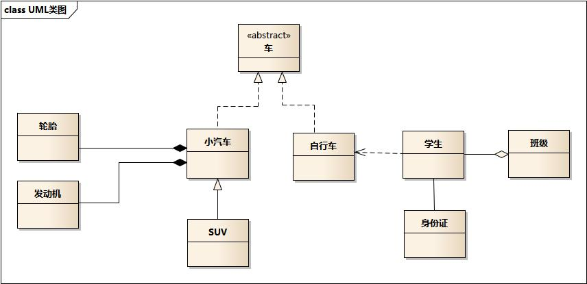
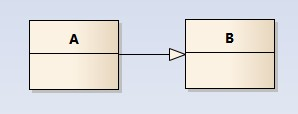
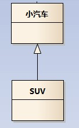
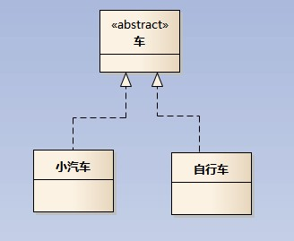
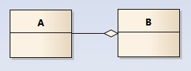
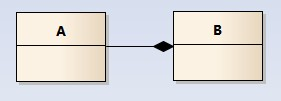
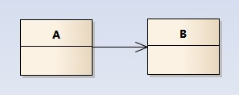
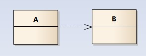
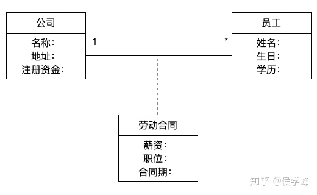

## UML 类图

### 概述

类图主要是用来显示系统中的类、接口以及它们之间的静态结构和关系的一种静态模型。类图描述一类的属性和操作，类图就是一个矩形的方框，上面是类的名字，中间是属性，下面是操作。

### 一个示例



- 车的类图结构为<<abstract>>，表示车是一个抽象类；

- 它有两个继承类：小汽车和自行车；它们之间的关系为 **实现关系**，使用带空心箭头的虚线表示；

- 小汽车为与 SUV 之间也是继承关系，它们之间的关系为 **泛化关系**，使用带空心箭头的实线表示；

- 小汽车与 发动机/轮胎 之间是 **组合关系**，使用带实心箭头的实线表示；

- 学生与班级之间是 **聚合关系**，使用带空心箭头的实线表示；

- 学生与身份证之间为 **关联关系**，使用一根实线表示；

- 学生上学需要用到自行车，与自行车是一种 **依赖关系**，使用带箭头的虚线表示；


### 类之间的关系

#### 泛化关系(generalization)

类的继承结构表现在UML中为：**泛化**(generalize)与 **实现**(realize)：

继承关系为 ```is-a``` 的关系；两个对象之间如果可以用 ```is-a``` 来表示，就是继承关系：（..是..)

eg：自行车是车、猫是动物

泛化关系用一条 **带空心箭头的直线** 表示；如下图表示（A继承自B）

泛化关系其实就是 **继承关系**：指的是一个类（称为子类、子接口）继承(```extends```)另外的一个类（称为父类、父接口）的功能，并可以增加自己额外的一些功能，**继承是类与类或者接口与接口之间最常见的关系**

在 Java 中此类关系通过关键字 ```extends``` 明确标识。



eg：汽车在现实中有实现，可用汽车定义具体的对象；汽车与 SUV 之间为泛化关系；




#### 实现关系(realize)

实现关系：指的是一个 ```class``` 类实现 ```interface``` 接口（可以实现多个接口）的功能；**实现是类与接口之间最常见的关系**

在 Java 中此关系通过关键字 ```implements``` 明确标识。

实现关系用一条 **带空心箭头的虚线** 表示；

eg：”车”为一个抽象概念，在现实中并无法直接用来定义对象；只有指明具体的子类(汽车还是自行车)，才可以用来定义对象（”车”这个类在 C++ 中用抽象类表示，在 JAVA 中有接口这个概念，更容易理解）




#### 聚合关系(aggregation)

聚合关系用一条 **带空心菱形箭头的直线** 表示，如下图表示 ```A``` 聚合到 ```B``` 上，或者说 ```B``` 由 ```A``` 组成



聚合关系 用于表示实体对象之间的关系，表示整体由部分构成的语义；例如一个部门由多个员工组成；

与 ```组合关系``` 不同的是，**整体和部分不是强依赖的，即使整体不存在了，部分仍然存在**；例如，部门撤销了，人员不会消失，他们依然存在


#### 组合关系(composition)

组合关系 用一条带 **实心菱形箭头直线** 表示，如下图表示 ```A``` 组成 ```B```，或者 ```B``` 由 ```A``` 组成；



与 聚合关系 一样，组合关系同样表示整体由部分构成的语义；比如公司由多个部门组成；

但组合关系是一种 **强依赖** 的特殊聚合关系，如果整体不存在了，则部分也不存在了；例如，公司不存在了，部门也将不存在了


#### 关联关系(association)

关联关系是用 **一条直线** 表示的；**它描述不同类的对象之间的结构关系**；它是一种静态关系，通常与运行状态无关，一般由常识等因素决定的；它一般用来定义对象之间静态的、天然的结构；所以，关联关系是一种 “强关联” 的关系；

比如，乘车人和车票之间就是一种关联关系；学生和学校就是一种关联关系

关联关系默认不强调方向，表示对象间相互知道；如果特别强调方向，如下图，表示 ```A``` 知道 ```B```，但 ```B``` 不知道 ```A``` 



注：在最终代码中，关联对象通常是以成员变量的形式实现的


#### 依赖关系(dependency)

依赖关系是用一套 **带箭头的虚线** 表示的；如下图表示 ```A``` 依赖于 ```B```；他描述一个对象在运行期间会用到另一个对象的关系



与关联关系不同的是，它是一种 **临时性的关系**，通常在运行期间产生，并且随着运行时的变化；依赖关系也可能发生变化；

显然，依赖也有方向，双向依赖是一种非常糟糕的结构，我们总是应该保持单向依赖，杜绝双向依赖的产生

注：在最终代码中，依赖关系体现为类构造方法及类方法的传入参数，箭头的指向为 **调用关系**；依赖关系除了临时知道对方外，还会 “使用” 对方的方法和属性；


### 其他关系

#### 三角关系

当某些属性值并不是由该类本身就可以确定的时候，我们可以使用三角关系，例如员工的薪资，职位等，并不是由公司可以确定的，而是由劳动合同来确定的，那么我们的表达方式如下：




参考：

- https://design-patterns.readthedocs.io/zh_CN/latest/read_uml.html

- https://zhuanlan.zhihu.com/p/77612862
