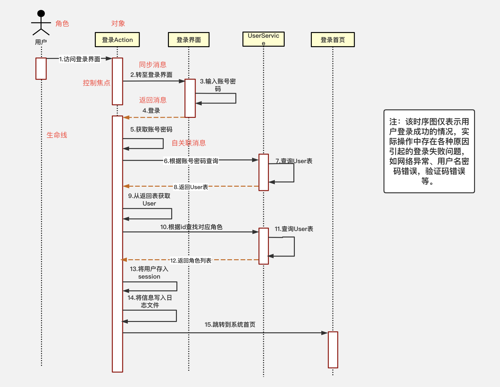

## UML 时序图

时序图（Sequence Diagram）是显示对象之间交互的图，这些对象是按时间顺序排列的。时序图中显示的是参与交互的对象及其对象之间消息交互的顺序。

visio 中对 时序图/序列图的描述是：表示类、组件、子系统或参与者的实例之间的消息序列。

### 时序图的元素

在画时序图时会涉及 ```7``` 种元素：

- 角色(```Actor```)

- 对象(```Object```)
 
- 生命线(```LifeLine```)

- 控制焦点(```Activation```)
  
- 消息(```Message```)
  
- 自关联消息、组合片段。

其中前 6 种是比较常用和重要的元素

#### 1. 角色(Actor)

系统角色，可以是人或者其他系统和子系统。以一个小人图标表示。

#### 2. 对象

位于时序图的顶部,以一个矩形表示。对象的命名方式一般有三种：

- 对象名和类名。
  - 例如：华为手机 : 手机、loginServiceObject:LoginService

- 只显示类名，不显示对象，即为一个匿名类。
  - 例如：: 手机、:LoginSservice。

- 只显示对象名，不显示类名。
  - 例如：华为手机 : 、loginServiceObject:。


#### 3. 生命线(LifeLine)

时序图中每个对象和底部中心都有一条垂直的虚线，这就是对象的生命线(对象的时间线)。以一条 **垂直的虚线** 表示。


#### 4. 控制焦点(Activation)

控制焦点代表时序图中在对象时间线/生命线上某段时期执行的操作。以一个 **很窄的矩形** 表示。


#### 5. 消息(Message)

表示对象之间发送的信息。消息分为三种类型。

- 同步消息(Synchronous Message)

  消息的发送者把控制传递给消息的接收者，然后停止活动，等待消息的接收者放弃或者返回控制。用来表示同步的意义。以一条 **实线和实心箭头** 表示。

- 异步消息(Asynchronous Message)

  消息发送者通过消息把信号传递给消息的接收者，然后继续自己的活动，不等待接受者返回消息或者控制。**异步消息的接收者和发送者是并发工作的**。

- 返回消息(Return Message)

  返回消息表示从过程调用返回。以 **左箭头和虚线** 表示。

#### 6. 自关联消息

表示方法的 **自身调用** 或者一个对象内的一个方法调用另外一个方法。以一条 **折回的实线和实心箭头** 表示。


### 例子

下面举例一个时序图的列子，看下上面几种元素具体的使用方式。  




### 组合片段

组合片段用来解决交互执行的条件和方式，它允许在序列图中直接表示逻辑组件，用于通过指定条件或子进程的应用区域，为任何生命线的任何部分定义特殊条件和子进程。组合片段共有13种，名称及含义如下：

组合名称 | 组合含义
-----|-----
ref | 引用其他地方定义的组合片段
alt | 在一组行为中根据特定的条件选择某个交互
opt | 表示一个可选的行为
break | 提供了和编程语言中的break类拟的机制
par | 支持交互片段的并发执行
seq | 强迫交互按照特定的顺序执行
strict | 明确定义了一组交互片段的执行顺序
neg | 用来标志不应该发生的交互
region | 标志在组合片段中先于其他交互片断发生的交互
ignore | 明确定义了交互片段不应该响应的消息
consider | 明确标志了应该被处理的消息
assert | 标志了在交互片段中作为事件唯一的合法继续者的操作数
loop | 说明交互片段会被重复执行


组合片段的功能平时用的不是很多，不是特别了解，用到了再说吧...