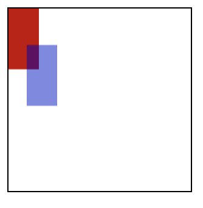
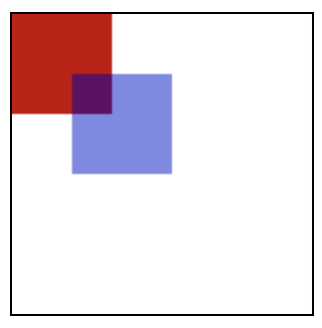

## 学习路上的坑坑坑坑

- 尝试给 canvas 设置宽高

  当我尝试用 css 样式给 canvas 设置宽高时，发现绘制的矩阵大小和我想象中的不太一样

  ```html
  <canvas id="canvas"></canvas>

  <style>
    #canvas {
      height: 150px;
      width: 150px;
      border: 1px solid black;
    }
  </style>
  ```

  ```js
  let canvas = document.querySelector('#canvas');
  let ctx = canvas.getContext('2d');
  ctx.fillStyle = "rgb(200,0,0)";
  ctx.fillRect(0, 0, 50, 50);
  ```

  

  检查元素的时候，canvas 还是会显示是 150px 宽，150px 高的一个有边框的正方式，但是在控制台输入 ```canvas.width``` 会打印出 ```300```，而 ```canvas.height``` 会打印出 ```150```。

  用 canvas 标签的自带属性就可以正常显示

  ```html
  <canvas id="canvas" width="150" height="150"></canvas>
  ```
  

  width / height 属性不用加单位，我尝试加了也没有报错。


为什么会这样呢？

Canvas 是一个画板和一张画纸，画板相当于一个容器，画图/作业是在画纸上进行的，画板和画纸的默认宽高是 ```300*150```，当画纸与画板宽高相等时，图像不会被拉伸，当画纸与画板宽高不一样时，图像就会被 **拉伸**（变形）。

- 通过 ```style``` 样式里设定的宽高仅是画板的宽高，画纸的宽高还是为默认值 ```300*150```

- 通过 ```width``` 和 ```height``` 属性是设定画板和画纸的宽高，即画板的宽高是 ```300*300```，画纸的宽高也是 ```300*300```，因此图像就不会被拉伸

