### 几何图形自动识别

- 项目背景介绍
- 项目难度分析
- 方案大纲
- 方案细节
- 项目取得的效果
- 项目后续优化

#### 项目背景介绍

原先几何图形的绘制步骤：点击几何图形的图标 --> 选择具体的几何图形 --> 在画布上进行绘制

这种方式对于用户来说过于繁琐，每次写字和几何图形的绘制都需要不断的切换画笔；为了提升用户的体验，我们希望用户可以在不切换模式的情况下，快速、便捷的绘制直线、圆、椭圆、多边形、曲线等基本图形。用户可以方便的画直线、椭圆进行批注、绘制几何图形用于教学，由此可见，几何图形自动识别有着广泛的应用场景。

#### 项目难度分析

- 数据处理阶段：因个人的书写习惯的差异或使用工具（例如鼠标、触摸板、手写板）的不同，会使存储笔迹的坐标点数组 pointList 中存在许多噪声点；
- 笔迹的识别阶段：最重要的是方案的选取，根据个人习惯，绘制图形的笔顺可能不同，绘制图形的角度也有所不同，我们需要一个具有普适性的识别方案。
- 其他：参考资料比较有限

#### 方案大纲

- 数据预处理：
	- 对采集的数据点进行等间距重采样
	- 重采样之后对采样点进行平滑处理
	- 角点/特征点的选取
- 识别阶段：
	- 直线的识别
	- 二次曲线的识别
	- 多边形的识别
- 拟合阶段：
	- 直线的拟合
	- 圆/椭圆、抛物线以及贝塞尔曲线的拟合
	- 多边形的拟合

#### 方案细节

##### 1. 数据预处理阶段

- 1.1 重采样
	
	以鼠标为例，鼠标在屏幕上移动速度较快时，在屏幕上留下的点数目较少，反之则较多。为了降低绘制速度对采样点的影响，首先对原始坐标点集合进行等间距采样。

	- Step1：设原始点集为 `Mp: {p1, p2, p3, ......, pn}`，定义 `S` 为重采样距离（其取值大小与采样后的坐标点总数成反比，取值过小，会造成程序运算时间增加；取值过大，会导致原始几何特征信息的丢失，因此我们把 `S` 设为可配置的）。令 `Dis(i, j)` 为原始点集中第 `i` 个和第 `j` 个点之间的距离，重采样点集定义为 `P`；
  
  - Step2：定义 `D = 0`，遍历 `Mp` 中每一个点，若 `D + Dis(i, j) > S`，则定义一个点 `M`，取其值为：
		
	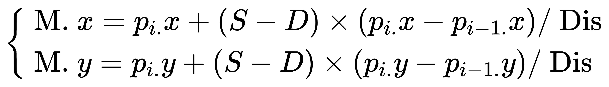
	
	并将点 `M` 加入重采样点集合 `P` 中；若条件不成立，则令 `D = D + Dis(i, j)`，重复上述过程，若最后一个点不满足上述条件，也将其加入到 `P` 中； 
	
  - Step3：结束，得到重采样点集合 ` P`。


- 1.2 平滑处理

	通常在人体总体平衡点情况下，局部肢体会有轻微的颤动，即便画出的线段看着比较平整，但把直线段方大显示时，将会观察到笔划是曲曲折折的，实际上其中包含很多段折线，这类干扰信息称为毛刺类型的噪声，其特征满足基于曲率点角点检测条件，会被误认为分割点，从而降低图形识别精度。

	本项目采用加权均值滤波算法进行去噪。均值滤波又被称为线性滤波，是常用的平滑方法，广泛用于计算机图形学中图像高斯噪声点去除，其原理是用待处理点周围像素的平均值代替原来图像中相应位置的像素值。加权均值滤波与均值滤波算法相比，利用滑动窗口的思想，考虑周围邻域坐标点对待处理点的影响不同，既达到去除噪声的目的，同时又保留原有的特征。

	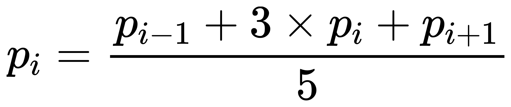

	其中，pi 为重采样点集合中的一个点，滑动窗口大小为 5， 选用模板为 1，3，1。

- 1.3 角点的选取以及伪角点的剔除

- 1.3.1 曲率的计算
  
	对于局部转角变化剧烈的角点，又称为拐点。我们根据 “角点附近的坐标点序列转角变化较大” 这一特征来检测角点。在平面几何中，曲线在某一点处的曲率可表示为该点的一个切线的倾斜角随弧长的变化率，曲率为：

	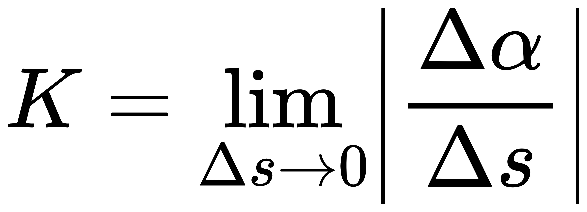

	- Step1：设坐标点序列集合为：P = {p1, p2, ..., pn}，其中 pi = {xi, yi}，令 di 为点序列中第 i 个和第 i-1 个点之间的欧式距离，则有：
		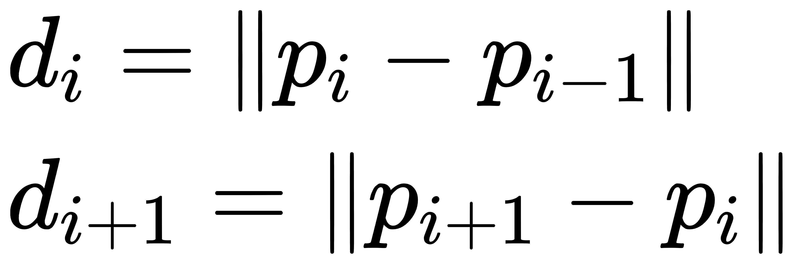 
	
	- Step2：将第 i 点的转角记为 alpha_i，其取值为向量 p_i-1p_i 与 X 轴正向之间的夹角，则有：
		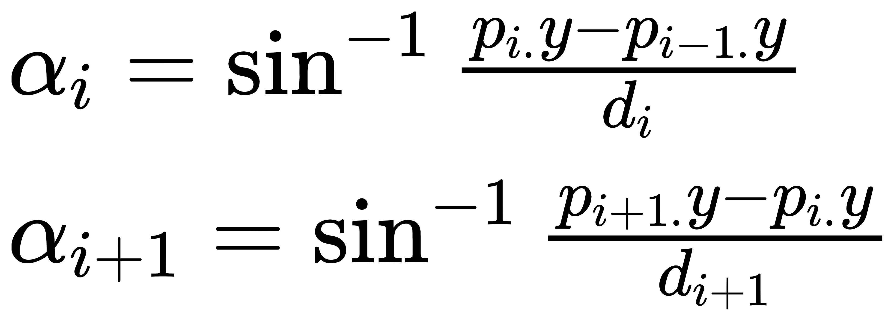

	- Step3：定义第 i 个点的转角变化为相邻两个转角的差值，则有：
		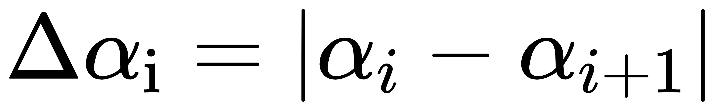
	
	- Step4：根据曲率的定义，既曲率为转角变化对弧长的变化率，由于坐标点为离散形式，于是采用两个相邻点之间的距离代替弧长，用于计算曲率值的模板尺寸为 3，则除首尾点外，笔画中任一个位置的离散曲率值为：
		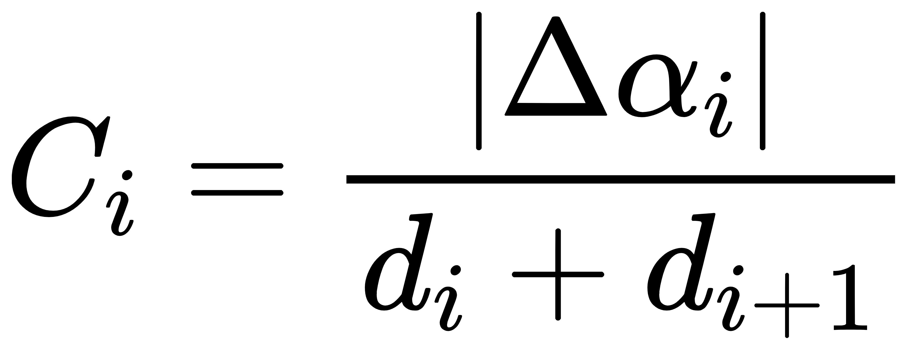


- 1.3.2 角点的选取

	角点处的曲率值要大于其周围其他点的曲率值，只要设置合适的极值计算模板尺寸，便可从采样点中提出角点，我们设置模板尺寸大小为 5。具体如下：

	对于某一个给定的曲率 ci，若 (ci > ci-2) && (ci > ci-1) && (ci > ci+1) && (ci > ci+2)，则将第 i 个点加入初始角点集合中。


- 1.3.3 伪角点的剔除

	在初始角点集合中，可能存在错误的角点（误识别），又称为伪角点。伪角点主要是由于用户在绘制过程中不自主的抖动和涂鸦本身的随意性造成的，对于伪角点的剔除，我们采取角点合并策略。

	- Step1：设 pi-1，pi，pi+1 为初始角点集合中任意相邻的三个角点，disa，disb，dis 分别为线段 pi-1pi、pipi+1、pi-1pi+1 的长度，则有：
	
	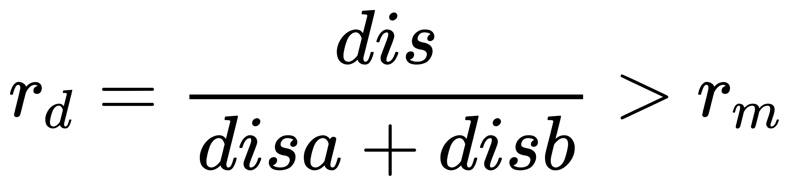

	其中，rd 为距离的比值，rm 为距离比阈值

	- Step2：若上述条件成立，则将角点 pi 从初识角点集合中剔除，同时再判断角点 pi-1、pi+1、pi+2 中 pi+1 的真伪性；
	
	- Step3：反之，则判断角点序列中 pi、pi+1、pi+2 中 pi+1 的真伪性；
	
	- Step4：重复上述过程，直到最后一个角点  


##### 2. 识别阶段

- 2.1 直线的识别

	- Step1：设采样点集合 S = {p1, p2, ..., pn}，首尾点之间的欧式距离 D 为：
		
	
	- Step2：其中对于每一个点 pi(xi，yi)，采样点间的累积距离 L 为：
		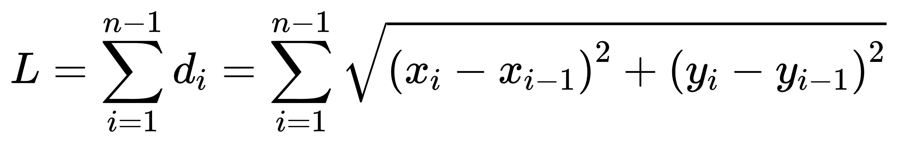

	- Step3：直线率 R 为：  
		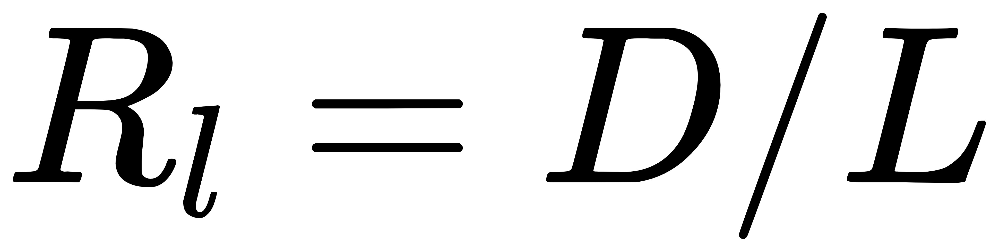 

	当直线率越接近 1 时，是直线的概率就越大，该项目直线率的选取为 0.96。 

- 2.2 二次曲线的识别

	根据二次曲线的不变量判断曲线的类型。
	设二次曲线的一般方程为：
	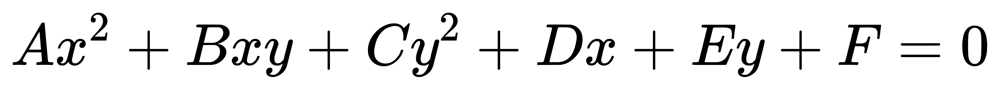

	I1、I2、I3 是二次曲线评议变换和旋转变换的不变量：
	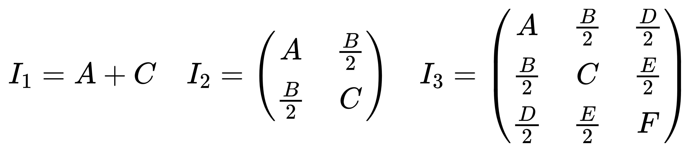

	```
	(I2 > 0) && (I1*I3 < 0) --> 椭圆
	(I2 == 0) && (I1 > 0) && (I3 != 0) --> 抛物线
	```

	二次曲线方程的参数由最小二乘法求出。令 F = 1，则目标函数为：

	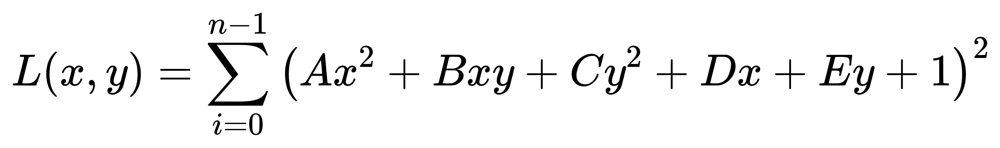

	想要求的目标函数取得极小值，则须使目标函数对各个参数的一阶导数为 0，整理成矩阵形式可得下列方程组：

	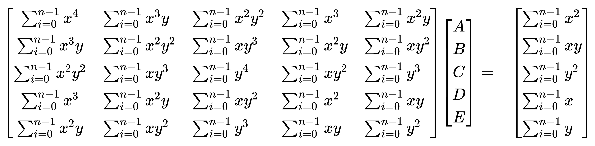


- 2.3 多边形的识别 

	根据判断角点的个数、图形是否封闭以及多边形的内角和来判断是否是多边形，例如角点个数为 4 且笔迹封闭，则判断为 3 边形。

	为了判定一些特殊的多边形，例如等腰三角形，直角三角形，矩形，平行四边形等等... 该项目提供了一些用于边的位置关系判断的函数：

	- 平行性判断
	- 垂直性判断
	- 相交性判断
	- 等长性判断


##### 3. 拟合阶段

定义了一个 json 结构，为上层绘制提供判断的类型，以及拟合后的数据点等信息。

```js
{
	uid: string,
	type: string,
	secondType: string,
	pointList: Array<Point>
}
```

- 3.1 直线的拟合
  
	考虑到提高计算效率，减少响应时间，在保证用户体验的前提下，直接将原始点集合中的首尾两个点赋值给 `pointList`。


- 3.2 圆/椭圆以及贝塞尔曲线的拟合

- 3.2.1 圆/椭圆和抛物线的拟合

	平面内任意位置的椭圆方程可表示为：

	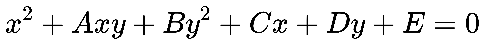

	接下来采用最小二乘法进行椭圆曲线的拟合，其目标函数为：

	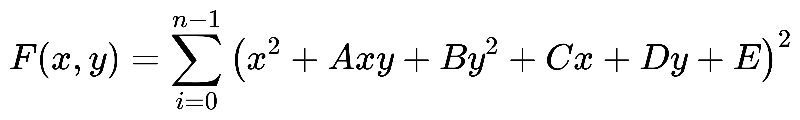

	要使目标函数取得极小值，则有目标函数对各个系数的一阶导数为 0，最终可求得 A、B、C、D、E 的值，进而得到平面内任意位置椭圆的各个参数，如下所示：

	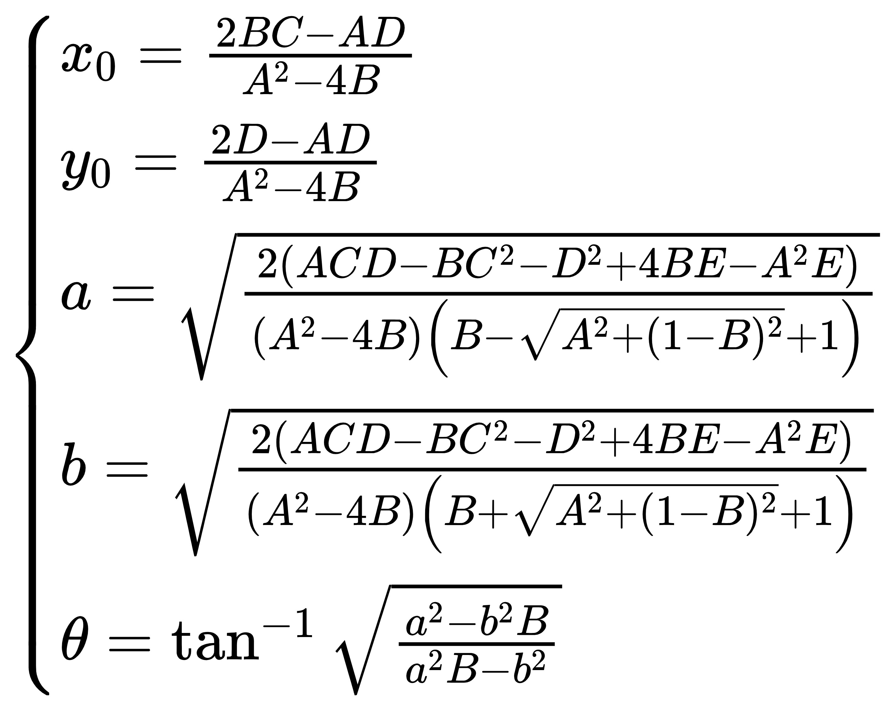

	其中 x0、y0 是圆心坐标，a、b 为长短轴长度，theta 为旋转角度。

	圆和抛物线的拟合与椭圆类似，只是采用的方程不同，圆的方程为：

	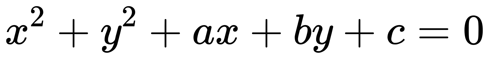

	抛物线的方程为：

	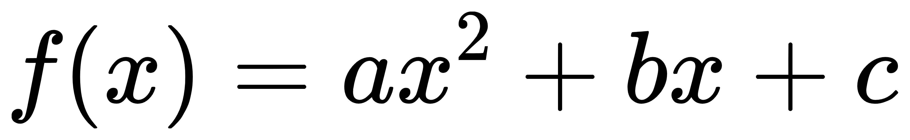

- 3.2.2 贝塞尔曲线的拟合(备用) 	

	对于一般曲线的拟合，采用三阶贝塞尔曲线拟合，贝塞尔曲线拟合的重点在于两个控制点的计算，模板尺寸大小为 3。


- 3.3 多边形的拟合

	将计算得到的角点列表赋值给 `pointList`。

#### 项目取得的效果

目前，该项目已经能较好的对直线进行识别和拟合，基本能识别圆/椭圆和多边形，支持对抛物线的识别和拟合。直线、圆/椭圆、多边形(n <= 6)已排期到 0902。

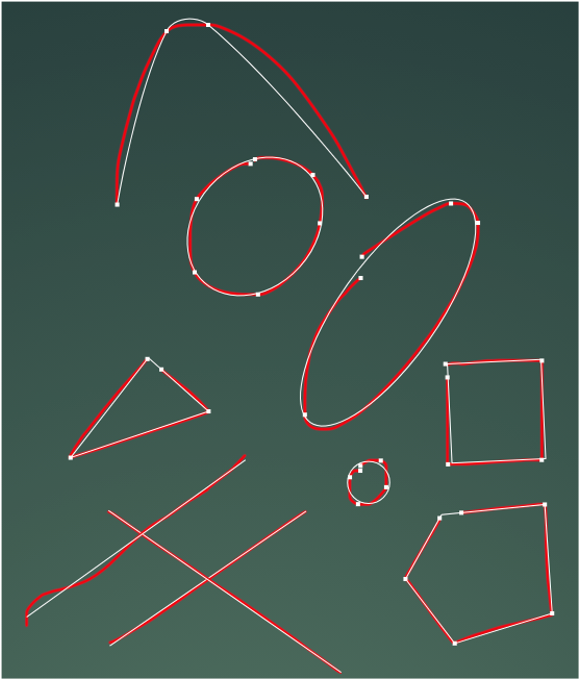

#### 项目后续优化

- 对于现有图形的算法优化（例如多边形的识别较为暴力，试图寻求一个新的方法），根据测试和用户反馈，针对于 bad case 进行改进；

- 新增几何图形的识别和几何，比如箭头，五角星，心型等...... 
