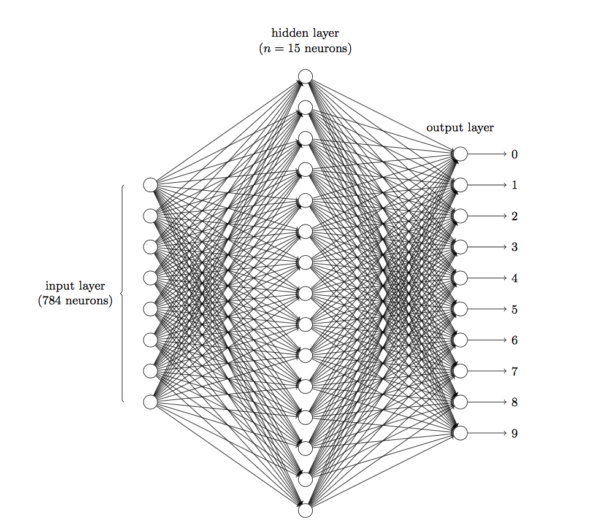
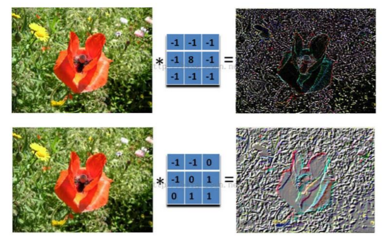

## 人类的视觉原理

人类的视觉原理如下：从原始信号摄入开始（瞳孔摄入像素 Pixels），接着做初步处理（大脑皮层某些细胞发现边缘和方向），然后抽象（大脑判定，眼前的物体的形状，是圆形的），然后进一步抽象（大脑进一步判定该物体是只气球）。下面是人脑进行人脸识别的一个示例：

对于不同的物体，人类视觉（可视皮层）也是通过这样逐层分级，来进行认知的：

我们可以看到，在最底层特征基本上是类似的，就是各种边缘，越往上，越能提取出此类物体的一些特征（轮子、眼睛、躯干等），到最上层，不同的高级特征最终组合成相应的图像，从而能够让人类准确的区分不同的物体。

图像特征的一些特点：

- 局部性
  - 对于一张图片，需要检测图片中的特征来决定图片的类别，通常情况下这些特征都不是由整张图片决定的，而是由一些局部的区域决定的。
- 相同性
  - 可以用同样的检测模式去检测不同图片的相同特征，只不过这些特征处在图片中的不同位置
- 不变性
  - 对于一张大图片，如果我们进行下采样，那么图片的性质基本保持不变。

如何写一个算法来分类图片？

我们不可能自己制定一个规则决定哪张图片属于哪一类，所以需要通过学习算法让机器自己知道如何分类。我们给计算机提供每种类别的图片，让机器自己去学习其中的特征并形成一个算法。这些算法是依赖于数据集的，所以也称为数据驱动的算法。

## 神经网络

神经网络由大量的神经元相互连接而成。每个神经元接受线性组合的输入后，最开始只是简单的线性加权，后来给每个神经元加上了非线性的激活函数，从而进行非线性变换后输出。每两个神经元之间的连接代表加权值，称之为权重（weight）。不同的权重和激活函数，则会导致神经网络不同的输出。

最常见的神经网络就是全连接神经网络

传统神经网络的问题：

理论上讲，增加的网络层可以看作是一系列恒等变换的网络层，深层的网络结构至少能够达到与这个浅层网络相同的效果。

- 传统神经网络在第4层之后再加深网络层数，对效果提升不大。
- 增大网络的层数和每层的节点数，相当于在增大网络的处理能力/表现能力，网络模型也更加复杂，然而却容易过拟合（将噪声的干扰方法了）
- 随着网络的复杂程度，参数量更大了

一个参数量计算的例子：

用两层全连接网络识别数字的分类：

图像是由一个个像素点构成的，每个像素点有3个通道，分别代表RGB颜色。

假设一张 28*28的灰度图，此时的图像尺寸是（28，28，1）==> 网络的输入有 28 * 28 = 784个神经元

假设隐藏层有 15 个神经元

针对权重 w 的参数个数 ==> 784 * 15 * 10 = 117600

针对偏置项 b 的参数个数 ==> 15 + 10 = 25

2层网络的总共参数为 117625。

## 卷积神经网络CNN的基本结构

一个例子：

计算机如何判断一张图片里是否包含 “x” 还是 “o”，并且假设必须两者选其一：

在计算机的 “视觉” 中，一幅图看起来就像是一个二维的像素数组（可以想象成一个棋盘），每一个位置对应一个数字。在我们这个例子当中，像素值"1"代表白色，像素值"-1"代表黑色。当比较两幅图的时候，如果有任何一个像素值不匹配，那么这两幅图就不匹配，至少对于计算机来说是这样的。

但是这么做，显然不合理。理想情况下，我们希望，对于那些仅仅是做了一些平移、缩放、轻微变形（局部特征不变）等简单变换的图像，计算机仍然能够识别出来图像。这就是 CNN 所要解决的问题。

CNN 之所以有效，主要是因为前面提到的图片局部性的特点。卷积核（滤波器）可以理解为特征提取器

典型的CNN由3个部分组成：

- 卷积层
- 池化层
- 全连接层

简单来描述的话：卷积层负责提取图像中的局部特征；池化层用来大幅降低参数量级(降维)；全连接层类似传统神经网络的部分，用来输出想要的结果。

### 卷积层

左边是图像输入，中间部分就是滤波器filter（带着一组固定权重的神经元），不同的滤波器filter会得到不同的输出数据，比如颜色深浅、轮廓。

卷积有两个很重要的性质：

一个是局部连接

一个是权值共享

每次滤波器都是针对某一局部的数据窗口进行卷积，这就是所谓的CNN中的 **局部感知** 机制。

- 打个比方，滤波器就像一双眼睛，人类视角有限，一眼望去，只能看到这世界的局部。如果一眼就看到全世界，你会累死，而且一下子接受全世界所有信息，你大脑接收不过来。当然，即便是看局部，针对局部里的信息人类双眼也是有偏重、偏好的。比如看人，对脸、身高、体型是重点关注，所以这3个输入的权重相对较大。

与此同时，数据窗口滑动，导致输入在变化，但中间滤波器Filter w0的权重（即每个神经元连接数据窗口的权重）是固定不变的，这个权重不变即所谓的CNN中的参数 **权重共享** 机制。

- 打个比方，某人环游全世界，所看到的信息在变，但采集信息的双眼不变。但是，不同人的双眼看同一个局部信息所感受到的不同，所以不同的滤波器就像不同的双眼，不同的人有着不同的反馈结果。

### 池化层

池化层的作用是进行特征选择，池化层简单来说就是下采样，可以有效降低数据维度，大大减少运算量，减少参数数量，有效避免过拟合。
卷积层虽然可以显著减少网络中连接的数量，但特征映射组中的神经元个数并没有显著减少。如果后面接一个分类器，分类器的输入维数依然很高，很容易出现过拟合。为了解决这个问题，可以在卷积层之后加上一个池化层，从而降低特征维数，避免过拟合。
池化（Pooling）是指对每个区域进行下采样（Down Sampling）得到一个值，作为这个区域的概括。常用的池化函数有：
（1）最大池化函数（Max Pooling）：选择一个区域内所有神经元的最大活性值作为这个区域的表示；
（2）平均池化函数（Mean Pooling）：一般是取区域内所有神经元活性值的平均值。

### 全连接层

CNN的实际应用

- 图像分类、检索

  

- 目标检测

  

- 目标分割

  

- 人脸识别

  

- 骨骼识别

  
