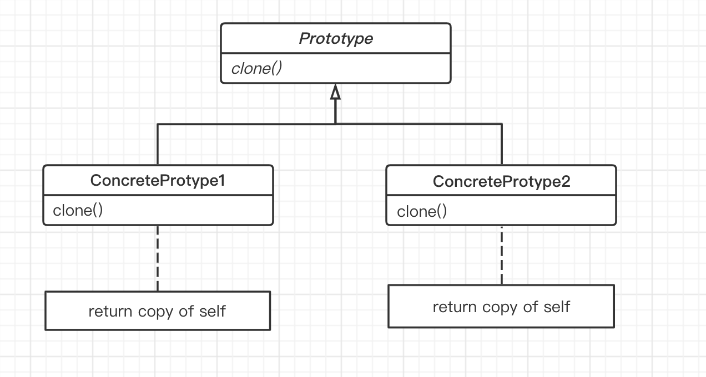

## 原型模型

#### 动机

在软件系统中，面临着 “某些结构复杂的对象” 的创建工作，由于需求的变化，这些对象经常面临着剧烈的变化，但是它们却拥有比较稳定一致的接口。

#### 定义

`Prototype` 模式对于 “如何创建易变体的实体对象” 采用 “原型克隆” 的方法来做，它是我们可以非常灵活地动态创建 “拥有某些稳定接口” 的新对象（所需工作仅仅是注册一个新类的对象 [即原型]，然后在任何需要的地方 `Clone`）。