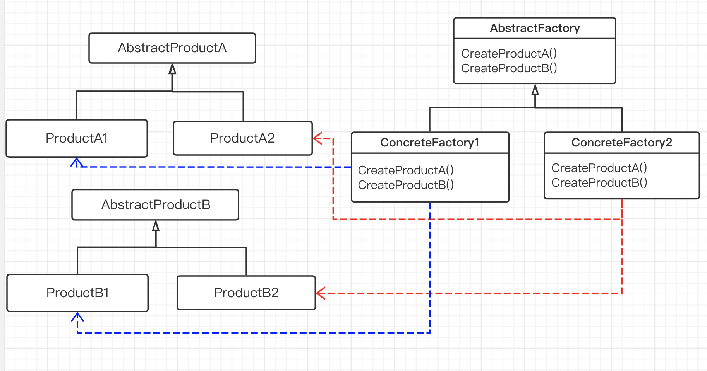

# 创建型模式

通过 “创建型” 模式绕开 `new`，来避免对象创建（new）过程中所导致的紧耦合（依赖具体类），从而支持对象创建的稳定。

### 典型模式：

- Factory Method
- Abstract Factory
- Prototype
- Builder
- Singleton

## 工厂方法和抽象工厂模式

### 工厂方法

定义一个用于创建对象的接口，让子类决定实例化哪一个类，工厂方法使一个类的实例化延迟(目的：解耦)到其子类。

工厂方法用于隔离类对象的使用者和具体类型之间的耦合关系。面对一个经常变化的具体类型，紧耦合关系会导致软件的脆弱。

工厂方法的优缺点：

优点 | 缺点 
---------|----------
 避免创建者和具体产品之间的紧密耦合 | 需要引入许多新的子类， 代码可能会因此变得更复杂
 单一职责原则 ✅ | 要求创建方法/参数必须相同
 开闭原则✅ 无需更改现有客户端代码，就可以在程序中引入新的产品类型。|

### 抽象工厂模式

提供一个创建一系列相关或相互依赖对象的接口，而无需指定它们具体的类。

抽象工厂模式的优缺点：

优点 | 缺点 
---------|----------
 可以确保同一工厂生成的产品相互匹配。 | 采用该模式需要向应用中引入众多接口和类， 代码可能会比之前更加复杂。
 可以避免客户端和具体产品代码的耦合。 | 难以应对 “新对象” 的需求变动
 单一职责原则 ✅ | 
 开闭原则✅ 无需更改现有客户端代码，就可以在程序中引入新的产品类型。|

如果没有应对 “多系列对象构建” 的需求变化，则没有必要使用抽象工厂模式；

“系列对象” 指的是在某一特定系列下的对象之间有相互依赖、或作用的关系，不同系列的对象之间不能相互依赖；

抽象工厂模式主要在于应对 “新系列” 的需求变动，难以应对 “新对象” 的需求变动。

