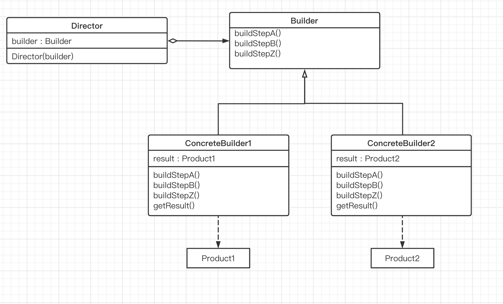

## 生成器模式

#### 动机

当面临着 “一个复杂对象” 的创建工作，其通常由各个部分的子对象用一定的算法构成；但是由于需求的变化，这个复杂对象的各个部分经常面临着剧烈的变化，但是将它们组合在一起的算法却相对稳定。

#### 定义

将一个复杂对象的构建与其表示相分离，使得同样的构建过程（稳定）可以创建不同的表示（变化）。

#### 结构表示

- Builder 模式主要用于 “分步骤构建一个复杂的对象”。在这其中 “分步骤” 是一个稳定的算法，而复杂对象的各个部分则经常变化。

- Builder 模式主要在于应对 “复杂对象各个部分” 的频繁需求变动，其缺点在于难以应对 “分步骤构建算法” 需求变动。