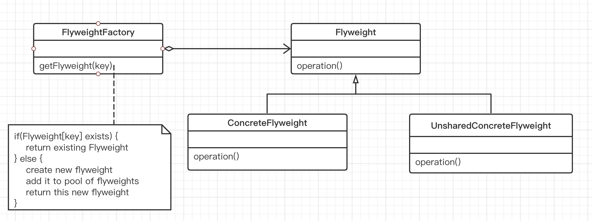

## 享元模式

#### 1. 意图

运用共享技术有效地支持大量的细粒度对象。

#### 2. 动机

- 在软件系统中采用纯粹对象方案的问题在于大量细粒度的对象会很快充斥在系统中，从而带来很高的运行时代价（主要指内存需求方面的代价）。

#### 3. 结构

Flyweight 采用对象共享的方法来降低系统中对象的个数，从而降低细粒度对象给系统带来的内存压力，Flyweight 主要解决面向对象的代价问题，一般不触及面向对象的抽象性问题。