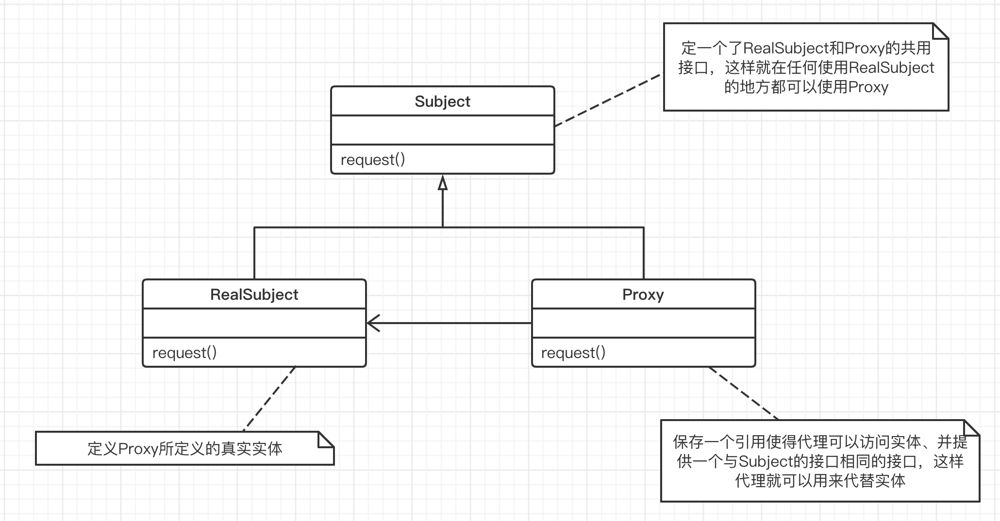

## 代理模式

“**接口隔离**”

在组件构建工程中，某些接口之间直接的依赖常常会带来很多问题，甚至根本无法实现。采用添加一层间接（稳定）接口，来隔离本来互相紧密关联的接口是一种常见的解决方案。

#### 1. 意图

为其他对象提供一种代理以控制（隔离，使用接口）对这个对象的访问。

#### 2. 动机

- 在面向对象系统中，有些对象由于某种原因（比如某些操作需要安全控制），直接访问会给使用者、或者系统结构带来很多麻烦。

#### 3. 结构

