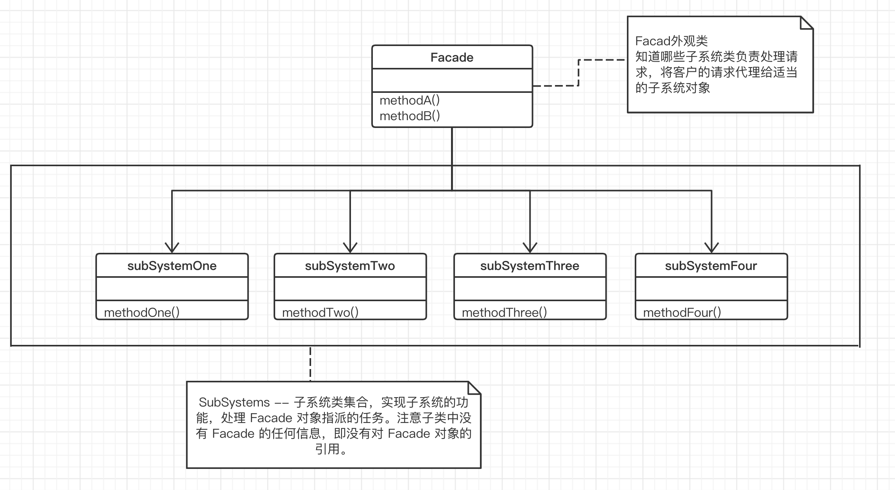

## 外观模式

“**接口隔离**”

在组件构建工程中，某些接口之间直接的依赖常常会带来很多问题，甚至根本无法实现。采用添加一层间接（稳定）接口，来隔离本来互相紧密关联的接口是一种常见的解决方案。

#### 1. 意图

为子系统中的一组接口提供一个一致（稳定）的界面，Facade 模式定义了一个高层接口，这个接口使得这一子系统更加容易使用（复用）。

#### 2. 动机

- 随着外部客户程序和各子系统的演化，两者之间过多的耦合面临着很多变化的挑战。

- 如何将外部客户程序的演化和内部子系统的变化之间的依赖相互解耦？

#### 3. 结构

Facade 模式简化了整个组件系统的接口，对于组件内部与外部客户程序来说，达到了一种 “解耦” 的效果（内部子系统的任何变化不会影响到 Facade 接口的变化），注意：Facade 模式中组件的内部应该是 “相互耦合关系比较大的一系列组件”，而不是一个简单的功能集合。