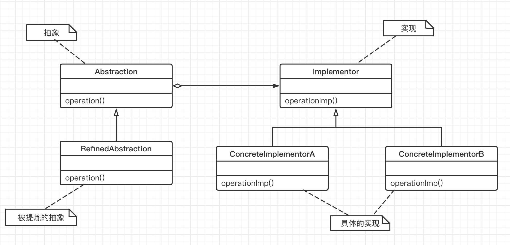

## 桥接模式

“**单一职责**”

在软件组件的设计中，如果责任划分的不清晰，使用继承得到的结果往往是随着需求的变化，子类急剧膨胀，同时充斥着重复代码，这时的关键是划清责任。

事实上，很多情况下用继承会带来麻烦。因为，其本质原因主要是因为继承是一种强耦合的结构。子类的实现与它的父类有非常紧密的依赖关系，父类变，子类就必须要变，所以我们在用继承时，一定要在是 `is-a` 的关系时再考虑使用，而不是任何时候都去使用。

#### 1. 意图

将抽象部分与它的实现部分分离，使它们都可以独立地变化。

#### 2. 动机

- 由于某些类型的故有实现逻辑，使得它们具有两个乃至多个变化的纬度。

- 如何应该这种 “多维度的变化”？如何使类型沿着两个或多个方向轻松的变化，而不引入额外的复杂度？

**桥接模式想要解决的问题：**

当一个类内部具备两种或多种变化维度时，使用桥接模式可以解耦这些变化的维度，使高层代码架构稳定。桥接模式的一个常见使用场景就是替换继承【因为父类拥有的方法，子类也会继承得到，无论子类需不需要，这说明继承具备强侵入性（父类代码侵入子类），同时会导致子类臃肿】。

#### 3. 结构

理解 “将抽象部分与它的实现部分分离”，实现系统可能有多角度分类，每一种分类都有可能变化，那么就把这种多角度分离出来让它们独立，减少它们之间的耦合。
