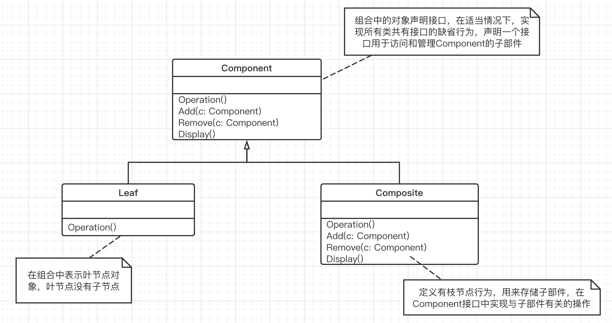

## 组合模式

“数据结构” 模式：

有一些组件在内部具有特定的数据结构，如果让客户程序依赖这些特定的数据结构，将极大地破坏组件的复用，这时候，将这些特定数据结构封装在内部，在外部提供统一的接口，来实现与特定数据结构无关的访问。

#### 1. 意图

将对象组合成树形结构以表示 “**部分-整体**” 的层次结构。组合模式使得用户对单个对象和组合对象的使用具有一致性。

#### 2. 动机

- 软件在某些情况下，客户代码过多地依赖于对象容器复杂的内部实现结构，对象容器内部实现结构（而非抽象结构）的变化将引起客户代码的频繁变化，造成代码的可维护性、可扩展性差。
- 如何将 “客户代码与复杂的对象容器结构” 解耦？让对象容器自己来实现自身的复杂结构，从而使得客户代码就像处理简单对象一样来处理复杂的对象容器。

#### 3. 结构

**组合模式的好处：**

基本对象可以被组合成更复杂的组合对象，而这个组合对象又可以被组合，这样不断地递归下去，用户不用关心到底是处理一个叶节点还是处理一个组合组件，从而将 “一对多” 的关系转化为 “一对一” 的关系，组合模式让客户可以一致地使用组合结构和单个对象。

当你发现需求中是体现 “**部分与整体**” 层次的结构时，以及你希望用户可以忽略组合对象与单个对象的不同，统一地使用组合结构中的所有对象时，就应该考虑组合模式了。将 “客户代码与复杂的对象容器结构” 解耦是 Composite 的核心思想，解耦之后，客户代码将与纯粹的抽象接口（而非对象容器的内部实现结构）发生依赖，从而更能应对变化。