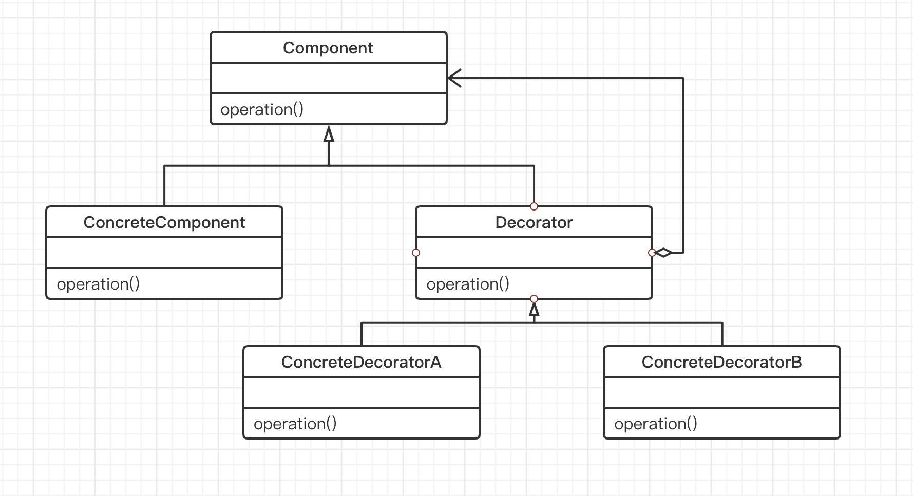

## 装饰模式

“**单一职责**”

在软件组件的设计中，如果责任划分的不清晰，使用继承得到的结果往往是随着需求的变化，子类急剧膨胀，同时充斥着重复代码，这时的关键是划清责任。

#### 1. 意图

动态（组合）地给一个对象添加一些额外的职责，就增加功能来说，装饰模式比生成子类（继承）更为灵活（消除重复代码 & 减少子类个数）。

#### 2. 动机

- 在某些情况下我们可能会 “过度地使用继承来扩展对象的功能”，由于继承为类型引入的静态特质，使得这种扩展方式缺乏灵活性；并且随着子类的增多（扩展功能的增多），各种子类的组合（扩展功能的组合）会导致更多子类的膨胀。

装饰模式是为已有功能动态添加更多功能的一种方式，当系统需要新功能的时候，是向旧的类中添加新的代码，这些新加的代码通常装饰了原有类的核心职责或主要行为，但问题在于在主类中加入了新的字段，新的方法和新的逻辑，从而增加了主类的复杂度，且这些新加入的东西仅仅是为了满足一些只在某种特定情况下才会执行的特殊行为的需要。

装饰模式的优点：把类中的装饰功能从类中搬移出去，这样可以简化原有的类，有效地把类的核心职责和装饰功能区分开了。

#### 3. 结构

通过采用组合而非继承的手法，装饰模式在接口上表现为 “is-a” Component 的继承关系，即表现为 Decorator 类继承了 Component 类所具有的接口，但在实现上又表现为 “has-a” Component 的组合关系，即 Decorator 类又使用了另外一个 Component 类。装饰模式的应用主要在于解决 “主体类在多个方向上的扩展功能”。