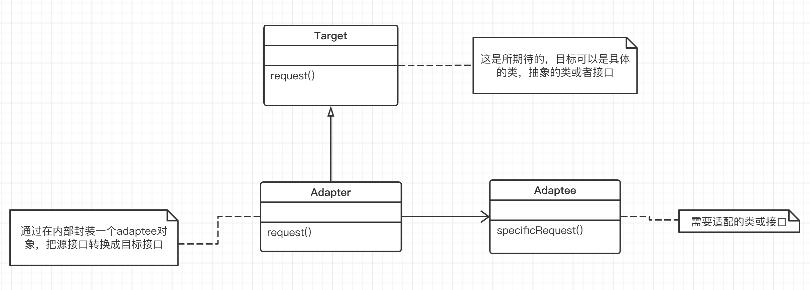

## 适配器模式

“**接口隔离**”

在组件构建工程中，某些接口之间直接的依赖常常会带来很多问题，甚至根本无法实现。采用添加一层间接（稳定）接口，来隔离本来互相紧密关联的接口是一种常见的解决方案。

#### 1. 意图

将一个类的接口转换成客户希望的另外一个接口。Adapter 模式（别名包装器）使得原本由于接口不兼容而不能一起工作的那些类可以一起工作。

#### 2. 动机

- 在软件系统中，由于应用环境的变化，常常需要将 “一些现存的对象” 放在新的环境中应用，但是新环境要求的接口是这些现存对象所不满足的。

**适配器模式主要解决什么问题：**

简单来说就是需要的东西就在眼前，却不能使用，且短时间又无法改造它，于是我们就想办法 **适配** 它。

在软件开发中就是，系统的数据和行为都正确，但接口不符时，我们应该考虑用适配器。适配器模式主要应用于，希望复用一些现有的类，但是接口又与复用环境要求不一致的情况下。

#### 3. 结构

Client 在 Adapter 实例上调用一些操作，接着适配器调用 Adaptee 的操作去实现这个请求。

Adapter 模式主要应用于 “希望复用一些现存的类，但是接口又与复用环境要求不一致的情况”。