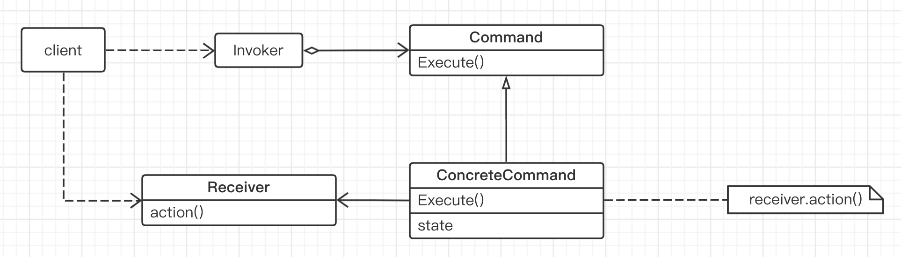

## 命令模式

“行为变化” 模式：

在组件的构建过程中，组件行为的变化经常导致组件本身剧烈的变化。“行为变化” 模式将组件的行为和组件本身进行解偶，从而支持组件行为的变化，实现两者之间的松耦合。

#### 1. 意图

将一个请求（行为）封装成一个对象，从而使你可用不同的请求对客户进行参数化，

#### 2. 动机

在软件构建过程中，“行为请求者” 与 “行为实现者” 通常呈现一种 “紧耦合”。但是在某些场合 -- 比如需要对行为进行 “记录、撤销/重做” 等处理，这些无法抵御变化等紧耦合是不合适的。

在这种情况下，如何将 “行为请求者” 与 “行为实现者” 解耦？ 将一组行为抽象为对象，可以实现二者之间的松耦合。

#### 3. 结构

Command 类，用来声明执行操作的接口
ConcreteCommand 类，将一个接受者对象绑定于一个动作，调用接收者相应的操作，以实现 Execute。
Invoker 类，要求该命令执行这个请求。
Receiver 类，知道如何实施与执行一个与请求相关的操作，任何类都可能成为一个接收者。

Command 模式的根本目的在于将 “行为请求者” 与 “行为实现者” 解耦，在面向对象语言中，常见的实现手段是 “将行为抽象为对象”。

Command 以面向对象中的 “接口-实现” 来定义行为接口规范，实现 Command 接口的具体命令对象 ConcreteCommand 有时候根据需要可能会保存一些额外的状态信息。通过使用 Composite 模式，可以将多个 “命令” 封装为一个 “复合命令” MacroCommand。