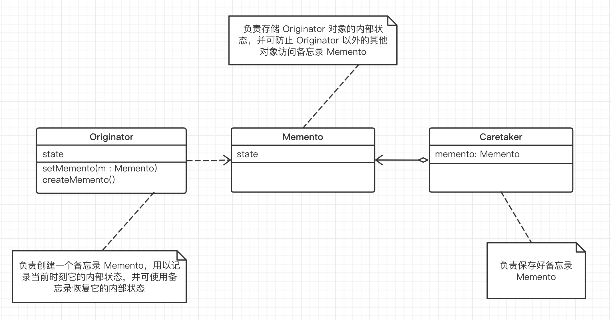

## 备忘录模式

"状态变化" 模式：

在组建构建过程中，某些对象的状态经常面临变化，如何对这些变化进行有效的管理？同时又维持高层模块的稳定？“状态变化” 模式为这一问题提供了一种解决方案。

#### 1. 意图

在不破坏封装性的前提下，捕获一个对象的内部状态，并在该对象之外保存这个状态。这样以后就可以将该对象恢复到原先保存的状态。

#### 2. 动机

- 在软件构建过程中，某些对象的状态在转换过程中，可能由于某种需求，要求程序能够回溯到对象之前处于某个点时的状态。如果使用一些公有接口来让其他对象得到对象的状态，便会暴露对象的细节实现。

- 如何实现对象状态的良好保存与恢复？但同时又不会因此而破坏对象本身的封装性。

#### 3. 结构

- 备忘录（Memento）存储原发器（Originator）对象的内部状态，在需要时恢复原发器状态。

- Memento 模式的核心是信息隐藏，即 Originator 需要向外隐藏信息，保持其封装性。但同时又需要将状态保持到外界（Memento）。

