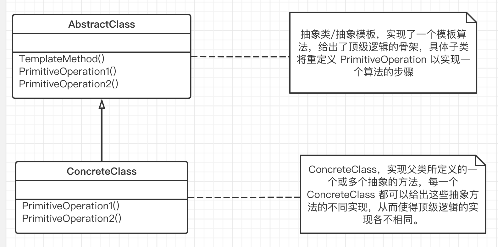

## 模板方法

“组件协作” 模式：

组件协作模式通过晚期绑定，来实现框架和应用程序之间的松耦合，是两者之间协作时的常用模式。

#### 1. 意图

定义一个操作中的算法的骨架（稳定），而将一些步骤延迟（变化）到子类中。模板方法可以使子类不改变（复用）一个算法的结构即可重定义（重写）该算法的某些特定步骤。

#### 2. 动机

在软件构建过程中，对于某一项任务，它常常有稳定的整体操作结构，但各个子步骤却有很多改变的需求，或者由于固有的原因（框架和应用程序之间的关系）而无法和任务的整体结构同时实现。

#### 3. 结构

模板方法是一种非常基础性的设计模式，在面向对象系统中有有着大量的应用