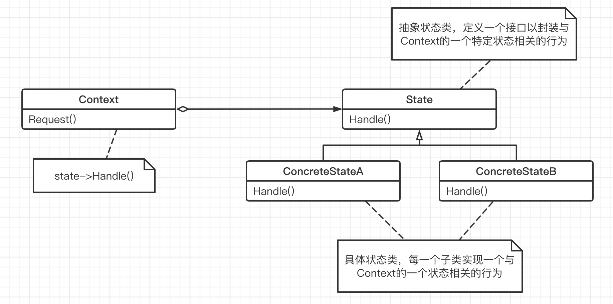

## 状态模式

"状态变化" 模式：

在组建构建过程中，某些对象的状态经常面临变化，如何对这些变化进行有效的管理？同时又维持高层模块的稳定？“状态变化” 模式为这一问题提供了一种解决方案。

#### 1. 意图

允许一个对象在其内部状态改变时改变它的行为。让对象看起来似乎修改了它的类。

#### 2. 动机

- 在软件构建过程中，某些对象的状态如果改变，其行为也会随之而发生变化（比如文档处于只读状态其支持的行为和读写状态支持的行为就不同）。

- 如何在运行时根据对象的状态来透明的更改对象的行为？而不会为对象操作和状态转换之间引入紧耦合？

#### 3. 结构

状态模式主要解决的是当控制一个对象状态转换的条件表达式过于复杂的情况。把状态的判断逻辑转移到表示不同状态的一系列类当中，可以把复杂的判断逻辑简化。