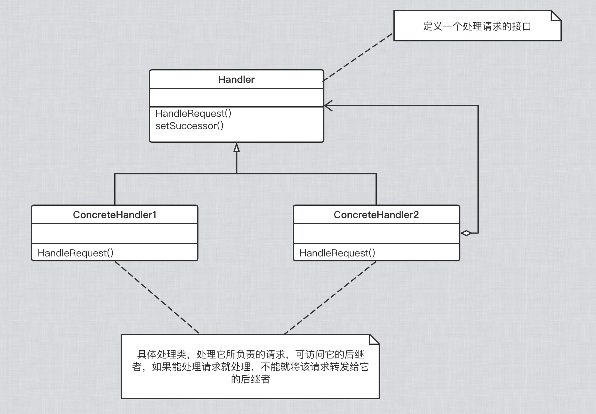

## 职责链

“数据结构” 模式：

有一些组件在内部具有特定的数据结构，如果让客户程序依赖这些特定的数据结构，将极大地破坏组件的复用，这时候，将这些特定数据结构封装在内部，在外部提供统一的接口，来实现与特定数据结构无关的访问。

#### 1. 意图

使多个对象都有机会处理请求，从而避免请求的发送者和接收者之间的耦合关系。将这些对象连成一条链，并沿着这条链传递请求，直到有一个对象处理它为止。

#### 2. 动机

在软件构建过程中，一个请求可能被多个对象处理，但是每个请求在运行时只能有一个接收者，如果显示指定，将必不可少的带来请求发送者和接收者之间的紧耦合。

#### 3. 结构

职责链模式的应用场合在于 “一个请求可能有多个接收者，但是最后真正的接收者只有一个”，职责链的目的就是将请求发送者和接受者解偶，从而更好的应对变化。