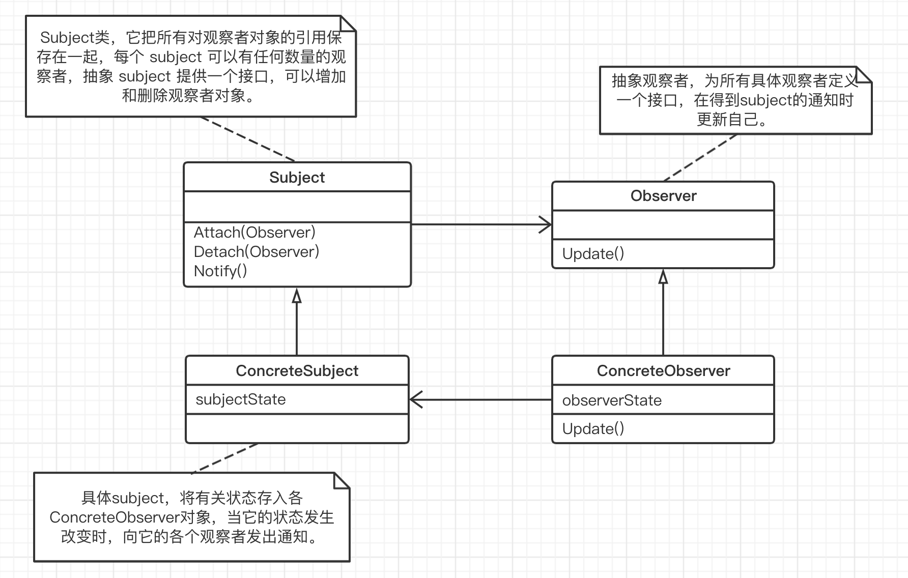

## 观察者模式

“组件协作” 模式：

组件协作模式通过晚期绑定，来实现框架和应用程序之间的松耦合，是两者之间协作时的常用模式。

#### 1. 意图

观察者模式又叫做发布-订阅者（publish/subscribe）模式，观察者模式定义了一种 **一对多** 的依赖关系，让多个观察者对象同时监听某一个主题对象。这个主题对象在状态发生变化时，会通知所有观察者对象，使它们能够自动更新自己。

#### 2. 动机

- 将一个系统分割成一系列相互协作的类有一个很不好的副作用，那就是需要维护相关对象间的一致性。我们不希望为了维持一致性而使各类紧密耦合，这样会给维护、扩展和重用都带来不便。

#### 3. 结构

观察者模式中的关键对象是  **目标Subject** 和  **观察者Observer** ，一个 subject 可以有任意数量的依赖它的观察者，一旦 subject 的状态发生改变，所有的观察者都得到通知。作为对这个通知的响应，每个观察者都将查询目标以使其状态与目标的状态同步。

**什么时候应该使用观察者模式：**

1. 当一个对象的改变需要同时改变其他对象的时候，而且它不知道具体有多少对象有待改变时

2. 观察者模式所做的工作其实就是在解除耦合。让耦合的双方都依赖于抽象，而不是依赖于具体。从而使得各自的变化都不会影响另一边的变化。

3. 使用面向对象的抽象，Observer 模式使得我们可以独立地改变目标与观察者，从而使二者之间的依赖关系达致松耦合。目标发送通知时，无需指定观察者，通知会自动传播；观察者自己决定是否需要订阅通知，目标对象对此一无所知。 

**观察者模式的不足：**

尽管已经用了依赖倒置原则，但是 “抽象通知者” 还是依赖  “抽象观察者”，也就是说，万一没有了抽象观察者这样的接口，通知的功能就完成不了了。