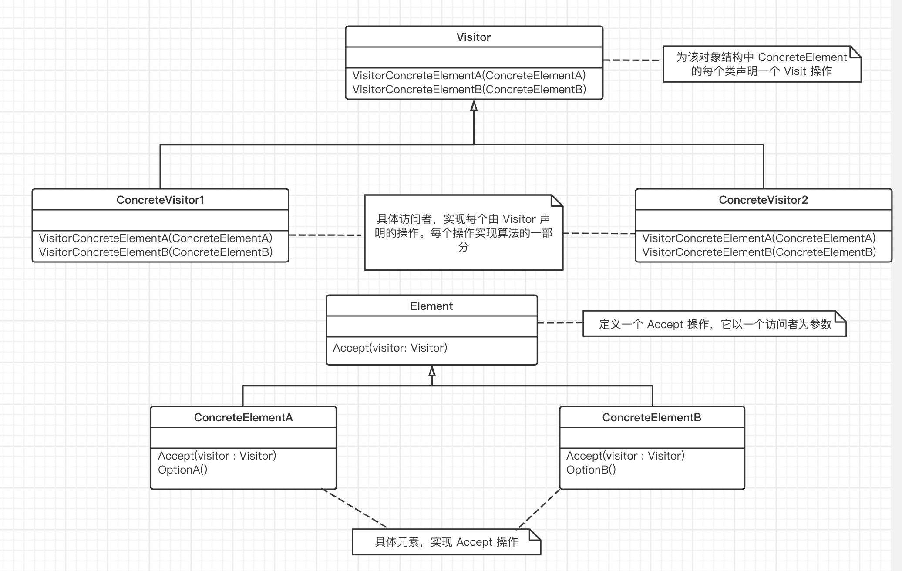

## 访问者模式

“行为变化” 模式：

在组件的构建过程中，组件行为的变化经常导致组件本身剧烈的变化。“行为变化” 模式将组件的行为和组件本身进行解偶，从而支持组件行为的变化，实现两者之间的松耦合。

#### 1. 意图

表示一个作用于某对象结构中的各元素的操作。使得可以在不改变（稳定）各元素的类的前提下定义（扩展）作用于这些元素的新操作（变化）。

#### 2. 动机

- 在软件构建过程中，由于需求的改变，某些类层次结构中常常需要增加新的行为（方法），如果直接在基类中做这样的更改，将会给子类带来很繁重的变更负担，甚至破坏原有设计。

- 如何在不更改类层次结构的前提下，在运行时根据需要透明地为类层次结构上的各个类动态添加新的操作，从而避免上述问题。 

#### 3. 结构

- Visitor 模式通过所谓双重分发（double dispatch）来实现在不更改（不添加新的操作 -- 编译时）Element 类层次结构的前提下，在运行时透明地为类层次结构上的各个类动态添加新的操作（支持变化）。

- 所谓双重分发即 Visitor 模式中间包括了两个多态分发：第一个为 accept 方法的多态辨析；第二个为 visitElementX 方法的多态辨析。

- Visitor 模式的最大缺点在于扩展类层次结构（增添新的 Element 子类），会导致 Visitor 类的改变，因此 Visitor 模式适用于 Element 子类层次结构稳定，而其中的操作却经常面临频繁改动。